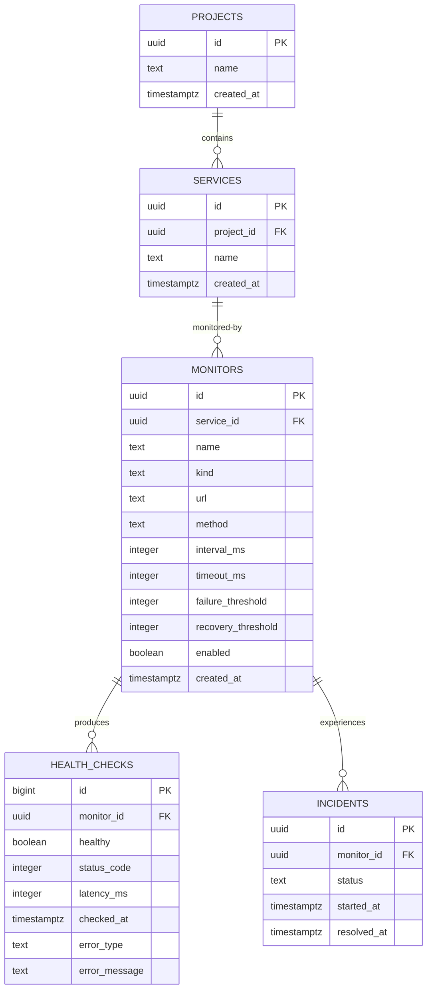

# Data Model

The canonical persisted model is defined by the Drizzle schema and generated PostgreSQL migration. Shared contracts describe the domain-facing shapes used between packages.



## Project

A Project is a software product or application. It owns zero or more Services.

| Field | Persistence |
| --- | --- |
| `id` | UUID primary key. Generated by the Project repository. |
| `name` | Required text. HTTP routes trim and reject empty names. |
| `createdAt` | Required timestamp with time zone. Supplied by the repository. |

Project listings are ordered by `createdAt DESC, id DESC`.

## Service

A Service is a logical or deployable component of a Project, such as an API, worker, or web application. It does not contain a monitoring URL, interval, timeout, or persisted health status.

| Field | Persistence |
| --- | --- |
| `id` | UUID primary key. Generated by the Service repository. |
| `projectId` | Required foreign key to Project. |
| `name` | Required text. HTTP routes trim and reject empty names. |
| `createdAt` | Required timestamp with time zone. Supplied by the repository. |

The `services(project_id)` index supports project-scoped listings. Those listings use `createdAt DESC, id DESC`.

## HTTP Monitor

A Monitor describes how Pulse observes a Service. Separating it from Service allows one Service to acquire multiple monitoring mechanisms without moving monitoring configuration back onto the Service.

The current `HttpMonitor` fields are:

| Field | Rules |
| --- | --- |
| `id` | UUID primary key. |
| `serviceId` | Required foreign key to Service; indexed. |
| `name` | Required text. |
| `kind` | Required; defaults to `http` and is constrained to `http`. |
| `url` | Required text. |
| `method` | Required; defaults to `GET`; constrained to `GET` or `HEAD`. |
| `intervalMs` | Required positive integer; defaults to `60000`. |
| `timeoutMs` | Required positive integer; defaults to `10000`. |
| `failureThreshold` | Required positive integer; defaults to `3`. |
| `recoveryThreshold` | Required positive integer; defaults to `1`. |
| `enabled` | Required boolean; defaults to `true`. |
| `createdAt` | Required timestamp with time zone. |

Only HTTP Monitors exist in v0.1. No Monitor management HTTP routes exist yet. Although `HEAD` is accepted by the contract and database, execution currently performs `GET` requests.

## Health Check

A Health Check is an immutable observation produced by running a Monitor.

| Field | Rules |
| --- | --- |
| `id` | PostgreSQL `bigint` identity primary key. |
| `monitorId` | Required foreign key to Monitor. |
| `healthy` | Required boolean. |
| `statusCode` | Nullable; when present, constrained to 100–599. |
| `latencyMs` | Required nonnegative integer. |
| `checkedAt` | Required timestamp with time zone. |
| `errorType` | Nullable; constrained to the six shared error categories. |
| `errorMessage` | Nullable text. |

The monitoring repository reads outcomes newest first using `checkedAt DESC, id DESC`. The identity ID provides deterministic ordering when timestamps are equal. Due-Monitor discovery treats a Monitor as current when a check is newer than `asOf - intervalMs`; otherwise it is due.

The shared `HealthCheck` contract currently declares its ID as a string, while PostgreSQL and the repository use `bigint`. Current monitoring writes omit the contract ID and receive a `bigint` from persistence. This is a known contract/persistence mismatch to resolve before exposing Health Checks through the API.

Allowed error types are:

- `http_error`
- `connection_error`
- `timeout`
- `dns_error`
- `tls_error`
- `network_error`

The current checker emits `http_error`, `timeout`, and `connection_error`; it does not yet distinguish DNS, TLS, and other network failures.

## Incident

An Incident is a period when a Monitor is considered unhealthy.

| Field | Rules |
| --- | --- |
| `id` | UUID primary key. |
| `monitorId` | Required foreign key to Monitor. |
| `status` | Required; constrained to `open` or `resolved`. |
| `startedAt` | Required timestamp with time zone. |
| `resolvedAt` | Nullable timestamp; the repository supplies it when resolving an Incident. |

The `incidents(monitor_id, started_at DESC)` index supports Monitor history. A partial unique index on `monitor_id WHERE status = 'open'` permits at most one open Incident for each Monitor. Repository insertion also uses conflict handling, so a competing open attempt returns no new Incident.

The check constraint rejects an open Incident with a resolution time and rejects a non-null resolution time earlier than `startedAt`. Because PostgreSQL check constraints accept an unknown result, the current expression does not reject a manually inserted `resolved` Incident whose `resolvedAt` is null. The repository always supplies `resolvedAt` during resolution, but the database constraint is weaker than the intended resolved-state invariant.

## Ownership and deletion

The ownership chain is:

```text
Project → Service → HttpMonitor → HealthCheck / Incident
```

Health Checks and Incidents belong to a Monitor rather than directly to a Service. Foreign keys do not specify cascading deletion in the current schema. Delete management routes are not implemented, so deletion behavior is intentionally outside the current API.

## Status

No current health field is persisted on Project, Service, or Monitor. Health is derived from checks and incidents. The shared `ServiceStatus` type (`healthy | unhealthy | unknown`) is an API/view concept and is not a database column.
