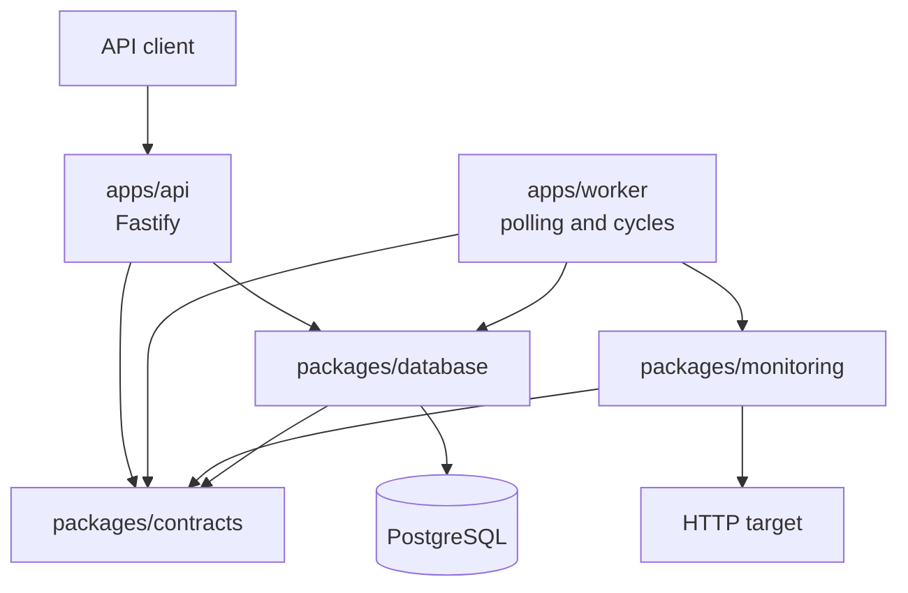

# Architecture Overview

## System shape

Pulse is a TypeScript pnpm monorepo running on Node.js 24. It currently contains two executable applications and three reusable packages.



The reusable packages do not depend on application packages. The API and worker compose packages at their executable boundaries; neither application is a dependency of another package.

## Workspace responsibilities

| Workspace | Responsibility |
| --- | --- |
| `apps/api` | Fastify routes, HTTP validation and responses, runtime composition of management repositories, and API shutdown. |
| `apps/worker` | Due-Monitor cycles, recurring polling, logging, runtime composition of monitoring and persistence, and graceful shutdown. |
| `packages/contracts` | Shared domain types for Projects, Services, HTTP Monitors, Health Checks, Incidents, statuses, and error categories. |
| `packages/database` | Drizzle schema, PostgreSQL client creation, migrations, repository queries, and integration-test database safety. |
| `packages/monitoring` | HTTP probing, pure incident decisions, and orchestration of one Monitor execution. |

There is no `apps/web` or shared configuration package in the current repository. Both appeared in the original design but remain planned.

## Dependency direction

```text
@pulse/monitoring ──> @pulse/contracts
@pulse/database   ──> @pulse/contracts
@pulse/api        ──> @pulse/contracts, @pulse/database
@pulse/worker     ──> @pulse/contracts, @pulse/database, @pulse/monitoring
```

Arrows point from a consumer to its dependencies. `@pulse/monitoring` has no Fastify, PostgreSQL, Drizzle, worker, or application dependency. Its one-Monitor orchestration accepts an HTTP checker and persistence operations through explicit arguments.

## API composition

`buildApp()` accepts Project, Service, and Monitor repository interfaces. Fastify injection tests supply in-memory implementations, so route tests require no database or `DATABASE_URL`.

The executable `server.ts` creates the PostgreSQL client and concrete repositories only inside `startServer()`. Its direct-execution guard prevents importing the module from starting a server or opening a database connection. `SIGINT` and `SIGTERM` close Fastify and the PostgreSQL pool.

Unexpected route errors are logged through Fastify and returned to clients as a generic server error. Validation and not-found behavior stay in the HTTP layer; repositories remain independent of Fastify.

## Database boundary

`createDatabase()` explicitly constructs a `pg` pool and Drizzle client. Importing `@pulse/database` does not require configuration or connect to PostgreSQL. The pool establishes connections when used and is owned by the application that created it.

The package exposes focused repositories for:

- Project management.
- Service management.
- Monitoring persistence and incident writes.

It does not provide a generic repository framework. The current schema is represented by one generated migration.

## Monitoring engine

Monitoring behavior is split into three layers:

1. `checkHttp()` performs one HTTP request and returns a structured result.
2. `decideIncidentAction()` is a pure function over newest-first outcomes, open-incident state, and thresholds.
3. `executeHttpMonitor()` persists the current result, loads recent outcomes and incident state, calls the decision function, and requests an incident write when needed.

An HTTP 500, timeout, or connection failure is a successful monitoring execution that produces an unhealthy Health Check. Database and orchestration exceptions remain thrown errors; they are not converted into fake HTTP failures.

The contracts and schema allow `GET` and `HEAD`. `executeHttpMonitor()` passes the configured method, URL, and timeout explicitly to `checkHttp()`.

## Worker runtime

The worker process composes the real database repository, HTTP checker, one-Monitor orchestration, and cycle runner.

A cycle:

1. Captures its current time.
2. Retrieves enabled HTTP Monitors that are due.
3. Executes them sequentially in discovery order.
4. Records a serializable success or error per Monitor.
5. Returns a cycle summary.

A thrown error for one Monitor does not prevent later Monitors from running. Due-discovery failure is a cycle-level failure and propagates to the polling layer.

The polling loop runs a cycle immediately, waits for it to finish, sleeps for the configured interval, and then starts the next cycle. It does not use `setInterval`, so cycles cannot overlap. A cycle-level error is logged and polling continues. The default polling interval is 10 seconds.

On `SIGINT` or `SIGTERM`, polling stops, the current cycle is allowed to settle, and the PostgreSQL pool closes.

The worker currently has no leases, distributed locks, queue, or bounded concurrency. The database prevents two open Incidents for one Monitor, but multiple worker processes are not coordinated for Monitor execution.

## Configuration boundaries

| Variable | Used by | Purpose |
| --- | --- | --- |
| `DATABASE_URL` | API, worker, Drizzle tooling | Runtime or tooling PostgreSQL connection. |
| `PULSE_WORKER_POLL_INTERVAL_MS` | Worker | Optional positive polling interval; defaults to `10000`. |
| `TEST_DATABASE_URL` | Integration tests, smoke test | Explicit guarded test database. |

Runtime configuration is read when executable composition starts. Reusable monitoring and application-construction modules can be imported without database configuration.

## Derived state

Service health is not stored on the `services` table. Current status is intended to be derived from Monitor observations and incident state. This avoids a second persisted status value that can drift from Health Checks and Incidents. `ServiceStatus` exists as a shared derived API/view type but is not currently exposed by a route.
